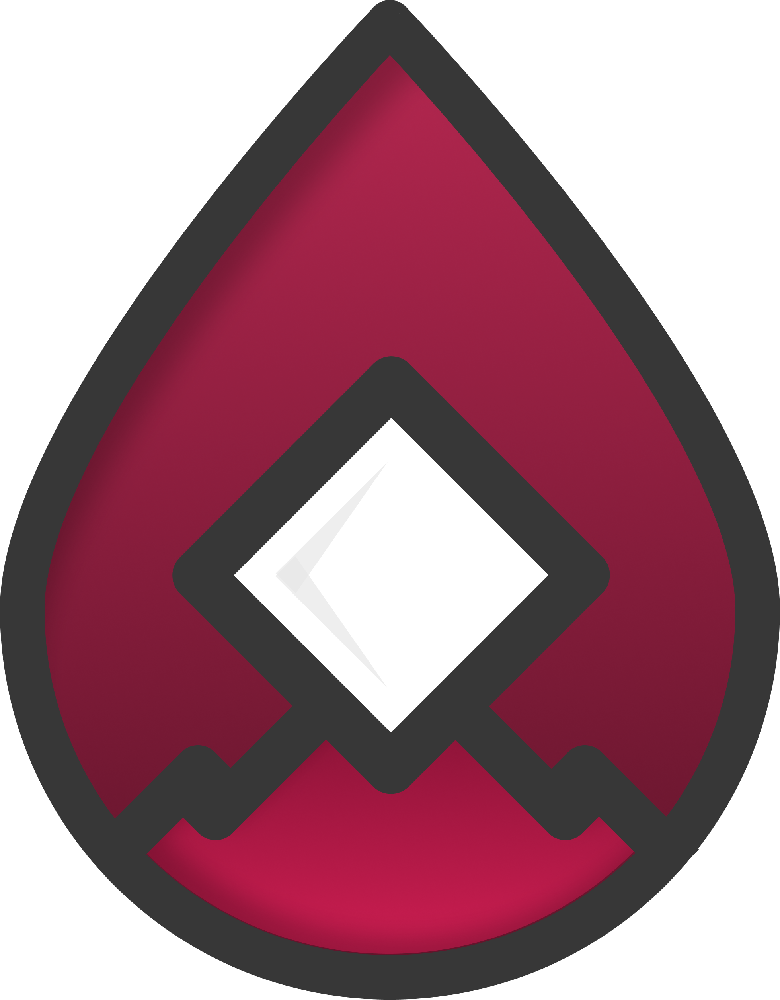

# Syndikx Framework

	

This project is now registered as the **Syndikx** framework.

All rights reserved to **MetaSyndikate Pvt. Ltd.**

---

This codebase was originally based on the Cyberpunk Brutalist Portfolio. The original project is available at https://www.figma.com/design/j9bLUjZFh6aS6JcNbJu31M/Cyberpunk-Brutalist-Portfolio.

## Running the code

Run `npm i` to install the dependencies.

Run `npm run dev` to start the development server.
  